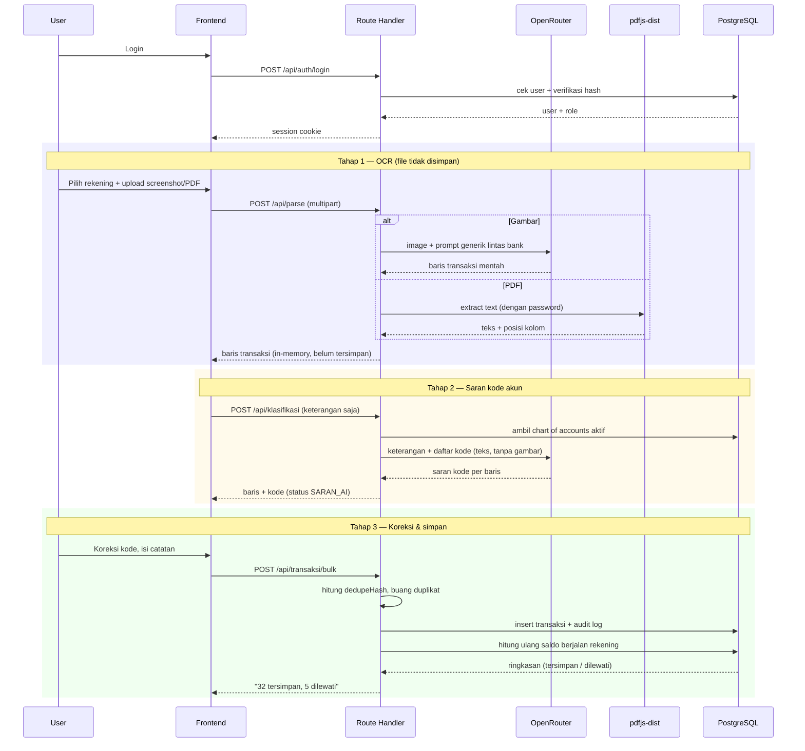
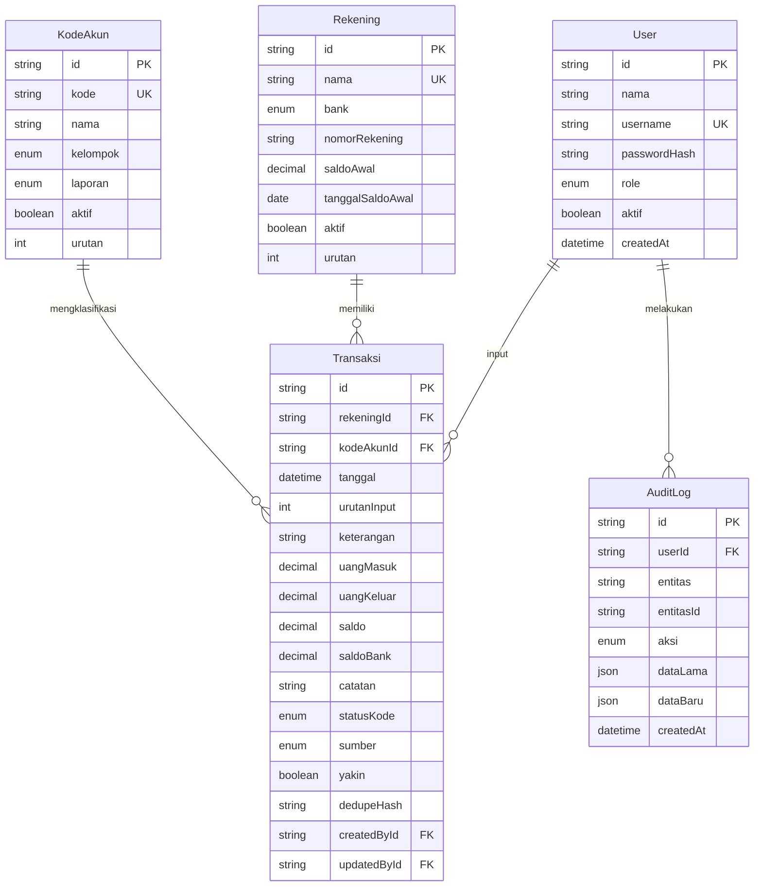

# PRD — Zaneva Mutasi v2 (Rekap Keuangan Multi-Rekening)

> **Status:** Draft — menunggu approval Rizky
> **Menggantikan:** `PRD-zaneva-mutasi.md` (v1, stateless parser)
> **Tanggal:** 6 Oktober 2026

---

## 0. Ringkasan Perubahan dari v1

v1 adalah **tool parsing stateless**: upload mutasi → download Excel → data hilang.
v2 mengubahnya jadi **aplikasi pembukuan multi-rekening dengan history dan dashboard**.

| Aspek | v1 (sekarang) | v2 (target) |
|---|---|---|
| Database | Tidak ada | PostgreSQL + Prisma |
| Auth | 1 password bersama | Multi-user + role, akun per orang |
| Data | Hilang setelah download | Tersimpan permanen (rekap final) |
| Output | Excel 5–6 kolom mentah | Rekap 8 kolom + kode akun |
| Klasifikasi | Tidak ada | Kode akun disarankan AI, dikonfirmasi tim |
| Rekening | Fix 2 bank (BNI, Mandiri) | Master data, bisa ditambah dari UI |
| Halaman | `/login`, `/mutasi` | + Dashboard, History, Master Data, Pengguna |
| Saldo | Apa adanya dari bank | Saldo berjalan dihitung sistem + rekonsiliasi |

> ⚠️ **Dua constraint v1 dibatalkan secara sadar oleh Rizky:**
> 1. *"Stateless total — tidak ada database"* → sekarang pakai PostgreSQL.
> 2. *"Tidak ada log/penyimpanan isi mutasi bank di server (privasi data finansial)"* → data mutasi kini tersimpan permanen. Konsekuensinya dibahas di §8 Risiko.

---

## 1. Overview

Tim keuangan Zaneva merekap mutasi dari banyak rekening bank (BCA, Mandiri, BRI, BNI, dan rekening CV terpisah) ke dalam satu format pembukuan berkode akun. Saat ini prosesnya manual: baca screenshot mutasi satu per satu, ketik ulang ke spreadsheet, tentukan kode akun, hitung saldo berjalan.

Zaneva Mutasi v2 mengotomatiskan rantai itu: **upload screenshot/PDF mutasi → AI baca transaksinya → AI sarankan kode akun → tim konfirmasi/koreksi → tersimpan jadi rekap permanen yang bisa dilihat history dan dashboard-nya.**

Pengguna: tim keuangan Zaneva (beberapa orang, bukan single user lagi). Tujuan utama: menghilangkan input manual berulang, dan memberi visibilitas cash flow lintas rekening secara real-time.

---

## 2. Requirements

- **Aksesibilitas:** Web, desktop-first. Harus tetap terbaca di HP (375px) karena tim kadang cek dashboard dari HP, tapi flow upload+koreksi dioptimalkan untuk desktop.
- **Pengguna:** Multi-user, 4 role — OWNER, ADMIN, STAFF, VIEWER.
- **Auth:** iron-session + username/password tersimpan di DB (hash). **Bukan** Google OAuth. Menggantikan `APP_PASSWORD` tunggal di v1.
- **Data Input:** Upload gambar (jpg/png, multi-file) dan PDF (berpassword). Plus input manual satu baris untuk koreksi/penyesuaian.
- **Export:** Excel (.xlsx) format rekap 8 kolom, per rekening per rentang tanggal.
- **Constraint khusus:**
  - Yang disimpan permanen **hanya rekap final**. Hasil parsing mentah dan file gambar/PDF sumber **dibuang** setelah diproses.
  - Semua nominal disimpan sebagai `Decimal(18,2)` — bukan float, bukan integer. Mutasi bank punya desimal (contoh: bunga bank `1.452,08`).
  - Timezone tampilan WIB, penyimpanan UTC.

---

## 3. Core Features

### 3.1 Autentikasi & Role (Must-have)

Login username + password. Role dibaca **fresh dari DB setiap request**, tidak dari cookie.

| Role | Dashboard | Upload & rekap | Koreksi kode/catatan | Hapus transaksi | Master data | Kelola user |
|---|:---:|:---:|:---:|:---:|:---:|:---:|
| OWNER | ✓ | ✓ | ✓ | ✓ | ✓ | ✓ |
| ADMIN | ✓ | ✓ | ✓ | ✓ | ✓ | — |
| STAFF | ✓ | ✓ | ✓ | — | — | — |
| VIEWER | ✓ | — | — | — | — | — |

- Seed user awal: `admin` / `admin123` (role OWNER), bisa di-override lewat env `SEED_ADMIN_PASSWORD`.
- Rate limit di endpoint login (5 percobaan / 15 menit per IP) — sudah ada di v1, dipertahankan.
- Logout membersihkan cookie.

### 3.2 Master Data — Rekening (Must-have)

CRUD rekening bank. Inilah yang mengisi dropdown pilih rekening.

Field: `nama` (bebas, contoh "BCA CV 1"), `bank` (BCA/MANDIRI/BRI/BNI/LAINNYA), `nomorRekening` (opsional), `saldoAwal`, `tanggalSaldoAwal`, `aktif`, `urutan`.

- `saldoAwal` + `tanggalSaldoAwal` adalah titik nol pembukuan rekening itu — jadi baris pertama rekap (kode `0000 Saldo`).
- Rekening yang sudah punya transaksi **tidak bisa dihapus**, hanya dinonaktifkan.
- Mengubah `saldoAwal` memicu hitung ulang seluruh saldo berjalan rekening tersebut, dengan dialog konfirmasi.

### 3.3 Master Data — Kode Akun (Must-have)

CRUD chart of accounts. Di-seed dari daftar ~150 kode milik Rizky (lampiran §9).

Field: `kode` (unik, string karena ada `0000` dan `52001`), `nama`, `kelompok` (HARTA/UTANG/MODAL/PENDAPATAN/BEBAN/PEMBELIAN/PINJAMAN/ALOKASI/LAINNYA), `laporan`, `aktif`, `urutan`.

- `laporan` = **masuk laporan apa**: `NERACA`, `LABA_RUGI`, `TIDAK_ADA` (sengaja tidak masuk laporan mana pun), atau kosong = *belum diatur*. Nilai awal hasil seed hanya tebakan dari kelompok (1xx/2xx/3xx/7xx → Neraca, 4xx/5xx/6xx → Laba Rugi); kode yang belum jelas (690, 699, 701, seluruh kelompok 8xx) dibiarkan *belum diatur*. Pemilik bisnis menyesuaikannya lewat UI.
- Seed tidak menimpa nama, kelompok, maupun laporan kode yang sudah ada, supaya penyesuaian lewat UI tidak hilang saat seed dijalankan ulang.

- Kode yang sudah dipakai transaksi tidak bisa dihapus, hanya dinonaktifkan.
- Kode nonaktif tidak muncul di dropdown saran, tapi tetap tampil di transaksi lama.

### 3.4 Rekap — Upload & Parsing (Must-have)

Flow inti. Satu halaman, empat langkah berurutan di layar yang sama.

**Langkah 1 — Pilih rekening.** Dropdown `SearchableSelect` dari master rekening aktif. Wajib dipilih sebelum upload.

**Langkah 2 — Upload.** Dua mode:
- **Screenshot** (prioritas utama) — multi-file gambar, bisa drag & drop atau paste Ctrl+V. Diparsing lewat OpenRouter AI vision dengan **prompt generik lintas bank**, bukan prompt per bank.
- **PDF** — satu file, dengan field password. Saat ini hanya Mandiri e-Statement yang punya parser khusus (`pdfjs-dist`, sudah ada di v1). Bank lain menyusul ketika contoh formatnya tersedia; sampai itu ada, PDF bank lain ditolak dengan pesan jelas.

**Langkah 3 — Saran kode akun otomatis.** Setelah baris transaksi terbaca, sistem memanggil AI **tahap kedua** (teks saja, tanpa gambar) untuk mencocokkan tiap keterangan transaksi ke chart of accounts. Hasilnya mengisi kolom Kode dengan status `SARAN_AI`.

> Dipisah dua tahap (OCR dulu, klasifikasi kemudian) supaya: (a) akurasi tiap tahap tidak saling mengganggu, (b) kode bisa dihitung ulang tanpa OCR ulang kalau chart of accounts berubah, (c) lebih murah.

**Langkah 4 — Preview, koreksi, simpan.** Tabel editable:
- Kolom **Kode** → dropdown `SearchableSelect` berisi seluruh kode akun. Begitu disentuh user, status berubah `SARAN_AI` → `DIKONFIRMASI`.
- Kolom **Catatan** → input teks bebas, opsional.
- Baris yang AI tandai tidak yakin → highlight merah + ikon peringatan.
- Baris terindikasi duplikat → ditandai dan **di-skip otomatis**, dengan ringkasan "N baris dilewati karena sudah ada" yang bisa dibuka detailnya.
- Baris bisa dihapus sebelum simpan.
- Tombol **Simpan ke Rekap** menulis ke DB.

### 3.4a Split Transaksi (Must-have)

Satu transaksi bank bisa dipecah jadi beberapa rincian, masing-masing dengan kode akun, nominal, dan keterangan sendiri. Contoh: penarikan ATM Rp 2.500.000 → Alokasi R 1.000.000 + Infaq 1.000.000 + Beban Operasional 500.000.

- **Rincian yang dihitung** di laporan, breakdown dashboard, dan kolom kode di export. **Transaksi asli tetap tersimpan** sebagai induk: dipakai untuk saldo berjalan dan rekonsiliasi, dan tampil di kolom Catatan saat export (`Split dari: ...`).
- **Total semua rincian harus persis sama** dengan nominal transaksi asli (dicek di UI dan di server, dalam Decimal). Minimal 2 rincian; nominal > 0; tiap rincian wajib punya kode akun. Arah (masuk/keluar) mengikuti transaksi asli.
- Bisa dilakukan di preview Rekap (sebelum simpan) maupun di halaman Transaksi (susulan, termasuk mengubah atau membatalkan split).
- Transaksi yang di-split tidak punya satu kode di induknya; mengubah kode induk ditolak. Membatalkan split mengembalikan transaksi ke "belum ada kode".
- Export Excel: tiap rincian jadi satu baris, saldo berjalan turun per rincian sehingga baris terakhir tetap berakhir di saldo bank.

### 3.5 Anti-Duplikat (Must-have)

Saat simpan, tiap baris dihitung `dedupeHash` = SHA-256 dari
`rekeningId | tanggal(YYYY-MM-DD) | uangMasuk | uangKeluar | keterangan(dinormalisasi: lowercase, spasi dirapikan)`.

Unique constraint `@@unique([rekeningId, dedupeHash])`. Baris yang hash-nya sudah ada → di-skip, dilaporkan ke user.

> ⚠️ **Keterbatasan yang harus disadari:** transaksi yang benar-benar kembar (dua transfer identik di hari yang sama, nominal dan keterangan sama persis) akan ikut ter-skip. Karena itu daftar baris yang di-skip **selalu ditampilkan**, dan tiap baris punya tombol **"Tetap masukkan"** untuk memaksa simpan. Sistem tidak boleh membuang data diam-diam.

### 3.6 Saldo Berjalan & Rekonsiliasi (Must-have)

Saldo **dihitung sistem**, bukan diambil dari bank:

```
saldo[0] = rekening.saldoAwal
saldo[n] = saldo[n-1] + uangMasuk[n] − uangKeluar[n]
```

Urutan: `tanggal` ASC, lalu `urutanInput` ASC (tie-breaker untuk transaksi di tanggal sama).

- Saldo versi bank (kalau terbaca di screenshot/PDF) disimpan terpisah di `saldoBank`, **hanya untuk pembanding**.
- Kalau `|saldo − saldoBank| ≥ 1` → baris ditandai warning "saldo tidak cocok, kemungkinan ada transaksi kelewat".
- Insert transaksi bertanggal mundur memicu **hitung ulang saldo seluruh rekening** itu dari `tanggalSaldoAwal`. Sederhana dan selalu benar; pada skala data ini (ribuan baris per rekening) biayanya tidak signifikan.

### 3.7 History / Daftar Transaksi (Must-have)

Tabel seluruh transaksi tersimpan, dengan:
- Filter: rekening, rentang tanggal, kode akun, status kode, kata kunci keterangan.
- Edit inline kode akun & catatan (tanpa pindah halaman).
- Hapus transaksi (OWNER/ADMIN saja, dengan dialog konfirmasi).
- Tambah transaksi manual satu baris (untuk penyesuaian yang tidak ada di mutasi bank).
- **Export Excel** hasil filter aktif, format 8 kolom (§7 Business Logic).

### 3.8 Dashboard (Must-have)

Empat blok, semuanya menghormati filter periode global:

1. **Saldo terkini per rekening** — kartu per rekening: nama, saldo terakhir, tanggal transaksi terakhir, badge kalau ada warning rekonsiliasi.
2. **Cash flow masuk vs keluar** — total masuk, total keluar, dan net per periode. Grafik tren bulanan (bar/line), bisa difilter per rekening atau gabungan.
3. **Breakdown per kode akun** — tabel + grafik: total nominal dikelompokkan per kode akun, diurutkan dari terbesar. Bisa di-drill ke daftar transaksinya.
4. **Baris yang belum beres** — daftar transaksi dengan kode kosong, status masih `SARAN_AI`, atau ditandai tidak yakin oleh AI. Berfungsi sebagai to-do list tim, dengan link langsung ke baris yang bersangkutan.

### 3.8a Laporan Keuangan (Must-have)

Halaman **Laporan** dengan empat tab, difilter periode (preset atau kustom) dan rekening. Semua laporan **basis kas**, dihitung dari satu kumpulan entri (transaksi tanpa split + rincian split), dalam sen (bilangan bulat).

- **Laba Rugi** — Pendapatan − Pembelian = Laba Kotor; − Beban = Laba Bersih. Hanya kode ber-`laporan = LABA_RUGI`.
- **Neraca** — per tanggal "sampai". Aset = kas per rekening (saldo awal + seluruh mutasi) + aset lain (kelompok Harta); Liabilitas = Utang + Pinjaman; Ekuitas = saldo awal rekening (modal awal) + Modal/Prive + laba ditahan + laba tahun berjalan.
- **Arus Kas** — metode langsung, dikelompokkan per `aktivitasKas` kode akun: Operasi, Investasi, Pendanaan, Pindah dana. Saldo kas awal + kenaikan = saldo kas akhir = total kas di Neraca.
- **Perubahan Modal** — modal awal + setoran modal − prive + laba bersih = modal akhir, dicocokkan dengan Total Ekuitas di Neraca.

Aturan penting:
- Identitas `Kas + Aset lain = Saldo awal + Liabilitas + Modal + Laba + Belum diklasifikasi` selalu terjaga. **Belum diklasifikasi** menampung transaksi tanpa kode atau yang kodenya belum diatur masuk laporan (atau diatur `TIDAK_ADA`); nilainya ditampilkan mencolok dengan tautan untuk memperbaiki, sehingga Neraca tidak pernah "dipaksa" seimbang secara diam-diam.
- **Neraca seimbang bukan pemeriksaan.** Identitas di atas benar secara konstruksi — tiap entri selalu masuk ke dua sisi sekaligus, jadi selisihnya selalu nol apa pun isi datanya. Diuji dengan sengaja merusak konfigurasi kode akun: selisih tetap nol. Karena itu badge "seimbang" dihapus; yang dipakai adalah pemeriksaan silang kas (lihat bawah). Hal yang sama berlaku untuk "modal akhir = total ekuitas" di Perubahan Modal.
- **Pemeriksaan silang kas (satu-satunya yang berarti):** kas versi laporan (saldo awal + Σ mutasi) dibandingkan dengan kolom `Transaksi.saldo` yang ditulis `hitungUlangSaldo` — dua jalur hitung berbeda. Diuji dengan merusak satu nilai saldo: pemeriksaan ini menangkapnya, sedangkan badge neraca tidak.
- **Baris bernilai nol tidak dicetak**, mengikuti kebiasaan laporan keuangan.
- **Filter satu rekening memberi peringatan**, karena transfer antar rekening hanya terlihat sebelah sehingga akun seperti Pengalihan Dana tidak akan nol.
- **Dashboard menampilkan Net (masuk − keluar), bukan masuk + keluar.** Menjumlah kedua arah menggandakan akun dua arah: Pengalihan Dana dengan masuk 40 jt dan keluar 40 jt sempat tampil "80 jt", padahal yang berpindah 40 jt dan efeknya nol.
- Kode kelompok selain Harta/Utang/Pinjaman/Modal yang ditandai Neraca: saldo debit jadi aset, saldo kredit jadi liabilitas.
- `aktivitasKas` pada Kode Akun: `OPERASI | INVESTASI | PENDANAAN | PINDAH_DANA`, nullable (belum diatur), nilai awal dari seed dan bisa diubah di UI.

Keterbatasan yang diketahui: saldo awal rekening dihitung sejak awal pembukuan tanpa memperhatikan `tanggalSaldoAwal`, jadi rekening yang dibuka di tengah tahun tetap muncul di laporan periode sebelum tanggal itu. Pembelian ke vendor dihitung penuh sebagai biaya (belum ada persediaan akhir).

### 3.9 Audit Trail (Must-have)

Setiap perubahan transaksi dan master data dicatat: siapa, kapan, aksi apa, nilai lama → nilai baru. Ditampilkan sebagai riwayat per transaksi (OWNER/ADMIN). Alasan: ini data uang, dan Rizky eksplisit minta jejak siapa mengubah apa.

### 3.10 Validasi & Error Handling (Must-have)

- File bukan gambar untuk mode screenshot / bukan PDF untuk mode PDF → ditolak, pesan jelas.
- Ukuran > 10MB per file, > 10 file sekaligus → ditolak.
- Password PDF salah → "Password PDF salah atau belum diisi", bukan crash.
- OpenRouter gagal/timeout/limit → pesan jelas + tombol coba lagi. Parsing yang gagal **tidak** menghasilkan baris kosong atau tebakan.
- AI tidak boleh mengarang baris yang tidak terlihat — baris meragukan ditandai `yakin: false`, bukan dibuang diam-diam.
- Simpan tanpa memilih rekening → ditolak di frontend dan backend.

---

## 4. User Flow

### Flow Utama — Rekap dari Screenshot

1. Login → mendarat di Dashboard.
2. Buka menu **Rekap**.
3. Pilih rekening dari dropdown (misal "BCA CV 1").
4. Paste/drag beberapa screenshot mutasi → klik **Proses**.
5. Sistem OCR tiap gambar → gabung → buang baris kembar antar-gambar (overlap karena scroll).
6. Sistem panggil AI tahap dua → kolom Kode terisi saran.
7. Tabel preview tampil. Tim telusuri: perbaiki kode yang salah, isi catatan seperlunya, hapus baris yang tidak perlu.
8. Klik **Simpan ke Rekap** → muncul ringkasan: "32 transaksi tersimpan, 5 dilewati karena duplikat".
9. Saldo berjalan dihitung ulang, warning rekonsiliasi muncul kalau ada selisih.

### Flow Export

1. Buka **Transaksi** → set filter (rekening + rentang tanggal).
2. Klik **Export Excel** → file `Rekap_<NamaRekening>_<periode>.xlsx` terdownload.

### Flow Setup Awal (sekali di awal)

1. OWNER login dengan seed `admin`/`admin123` → **ganti password**.
2. Buat akun untuk tiap anggota tim, tentukan role.
3. Buka Master Data → Rekening → tambah semua rekening + isi `saldoAwal` dan `tanggalSaldoAwal` tiap rekening.
4. Cek Master Data → Kode Akun, sesuaikan kode hasil seed kalau perlu.

### Edge Cases

| Situasi | Perilaku |
|---|---|
| Screenshot overlap karena scroll | Baris kembar dibuang otomatis sebelum preview |
| Transaksi kembar yang sah | Di-skip tapi dilaporkan; ada tombol "Tetap masukkan" |
| Gambar blur / terpotong | Baris tetap muncul, ditandai merah, tim yang putuskan |
| AI tidak yakin kode akunnya | Kode dibiarkan kosong, masuk daftar "belum beres" |
| Upload mutasi bulan lama setelah bulan baru | Saldo seluruh rekening dihitung ulang otomatis |
| Saldo hitung ≠ saldo bank | Warning per baris + badge di kartu rekening dashboard |
| PDF bank yang parsernya belum ada | Ditolak: "Parser PDF untuk bank ini belum tersedia, pakai mode Screenshot dulu" |
| Rekening belum punya saldo awal | Diblokir sebelum upload, diarahkan ke master rekening |
| Belum ada data sama sekali | Empty state "Belum ada data" + tombol ke halaman Rekap |

---

## 5. Architecture



---

## 6. Database Schema



| Tabel | Fungsi |
|-------|--------|
| `User` | Akun anggota tim + role. Menggantikan `APP_PASSWORD` tunggal v1. |
| `Rekening` | Master rekening bank. Mengisi dropdown pilih rekening, menyimpan saldo awal. |
| `KodeAkun` | Chart of accounts, di-seed dari daftar Rizky, bisa dikelola dari UI. |
| `Transaksi` | **Rekap final.** Satu baris = satu baris di output rekap. Hanya data terkoreksi yang masuk sini. |
| `AuditLog` | Jejak perubahan transaksi & master data: siapa, kapan, dari apa ke apa. |

**Enum:**
- `Role`: `OWNER | ADMIN | STAFF | VIEWER`
- `Bank`: `BCA | MANDIRI | BRI | BNI | LAINNYA`
- `Kelompok`: `HARTA | UTANG | MODAL | PENDAPATAN | PEMBELIAN | BEBAN | PINJAMAN | ALOKASI | LAINNYA`
- `StatusKode`: `KOSONG | SARAN_AI | DIKONFIRMASI`
- `Sumber`: `SCREENSHOT | PDF | MANUAL`
- `AksiAudit`: `BUAT | UBAH | HAPUS`

**Index penting:**
- `@@unique([rekeningId, dedupeHash])` — penegak anti-duplikat.
- `@@index([rekeningId, tanggal, urutanInput])` — untuk hitung saldo berjalan & tabel history.
- `@@index([kodeAkunId])` — untuk breakdown dashboard.
- `@@index([statusKode])` — untuk daftar "belum beres".

**Yang sengaja TIDAK ada tabelnya:** hasil parsing mentah, file gambar/PDF sumber. Sesuai keputusan Rizky — keduanya dibuang setelah diproses, hanya hidup di memori request.

---

## 7. Design & Technical Constraints

### Tech Stack

| Lapisan | Pilihan | Catatan |
|---|---|---|
| Frontend | Next.js 16 App Router, React 19, TypeScript | Sudah ada di v1 |
| Styling | Tailwind v4 | Sudah ada |
| Backend | Next.js Route Handlers | Sudah ada |
| ORM | Prisma 7 + `@prisma/adapter-pg` | **Baru** |
| Database | PostgreSQL | **Baru** — perlu service Postgres di EasyPanel |
| Auth | iron-session 8 + hash password (`argon2` / `bcrypt`) | Diperluas dari v1 |
| Dropdown | `SearchableSelect` (cmdk + `@radix-ui/react-popover`) | **Baru** — wajib per standar UI |
| OCR & klasifikasi | OpenRouter, model dari env `OPENROUTER_MODEL` | Sudah ada, diperluas |
| PDF | `pdfjs-dist` | Sudah ada |
| Excel | `exceljs` | Sudah ada, format output berubah |
| Grafik | **Recharts** | **Baru** — butuh persetujuan, belum ada di baseline stack |
| Notifikasi | `sonner` | Sudah ada |
| Deploy | EasyPanel + Dockerfile, port 3000 | Sudah ada, + env `DATABASE_URL` |

### UI System

Mengikuti standar app internal (bukan dark-only):
- **Light + dark + system**, default ikut OS. Inline anti-FOUC script di `<head>` — sudah ada di v1, dipertahankan.
- Kontras **WCAG AA 4.5:1**, tiap kelas warna teks wajib punya pasangan `dark:`.
- **Semua dropdown pakai `SearchableSelect`** tanpa syarat jumlah opsi. Kritis di sini karena dropdown kode akun berisi ~150 entri — tanpa search tidak terpakai.
- Layout: sidebar kiri (drawer di HP), topbar berisi nama app + toggle tema + nama user + logout.
- Tabel dibungkus `overflow-x-auto`, dites di 375px.
- Tiap halaman data punya: loading state (skeleton), empty state, error state + "coba lagi", toast sukses, dialog konfirmasi sebelum hapus.

### Naming Convention

- Label UI & field bisnis: **Bahasa Indonesia** (Tanggal, Keterangan, Uang Masuk, Uang Keluar, Saldo, Catatan, Kode).
- Istilah baku tetap Inggris: Dashboard, Cash Flow, Export, Import, Report.
- Fungsi/variabel/komponen: Inggris, camelCase/PascalCase.
- API routes: kebab-case.
- Enum: UPPER_SNAKE_CASE.

### Business Logic Hardcoded

Aturan berikut **tidak boleh diubah tanpa konfirmasi Rizky**:

1. **Kolom output rekap (urut, persis):**
   `No | Tanggal | Kode | Keterangan | Uang Masuk | Uang Keluar | Saldo | Catatan`
2. **Saldo berjalan:** `saldo[n] = saldo[n-1] + uangMasuk[n] − uangKeluar[n]`, dengan `saldo[0] = rekening.saldoAwal`. Urut berdasarkan `tanggal` lalu `urutanInput`.
3. **Toleransi rekonsiliasi:** selisih `< Rp 1` dianggap cocok (pembulatan).
4. **Baris saldo awal** memakai kode `0000 Saldo` — kode sistem, tidak bisa dihapus dari master.
5. **Dedupe key:** `rekeningId + tanggal(YYYY-MM-DD) + uangMasuk + uangKeluar + keterangan(lowercase, spasi dinormalisasi)`.
6. **Nominal** disimpan `Decimal(18,2)` — bukan float. Mutasi bank punya desimal nyata (bunga bank `1.452,08`).
7. **Format tampilan:** `Rp 1.250.000` (tanpa desimal) untuk ringkasan dashboard; `1.250.000,50` (dua desimal) di tabel transaksi dan Excel.
8. **Tanggal:** tampil `6 Okt 2026`, timezone WIB. Simpan UTC.
9. **AI tidak boleh mengarang.** Baris meragukan → `yakin: false`. Kode akun tidak yakin → dibiarkan kosong, bukan ditebak.

### Constraint Lain

- `OPENROUTER_API_KEY` dan `DATABASE_URL` hanya di server, tidak pernah sampai ke browser.
- Role dibaca fresh dari DB tiap request, bukan dari isi cookie.
- Maks 10MB per file, maks 10 file sekaligus.
- Kredensial tidak pernah masuk repo — hanya `.env.example` berisi nama key.
- Semua endpoint mutasi data dicek role di server, bukan cuma disembunyikan di UI.

---

## 8. Risiko & Hal yang Perlu Disadari

| # | Risiko | Mitigasi |
|---|---|---|
| 1 | **Data finansial kini tersimpan permanen.** Constraint privasi v1 dibatalkan. | Akses dibatasi role; DB tidak diekspos publik; backup rutin Postgres di EasyPanel perlu diatur. Ini konsekuensi yang sudah Rizky setujui. |
| 2 | **Transaksi kembar sah ikut ter-skip** oleh anti-duplikat. | Daftar yang di-skip selalu ditampilkan + tombol "Tetap masukkan". Tidak pernah membuang diam-diam. |
| 3 | **Akurasi saran kode AI** — banyak kode bernama mirip (lihat §9 open items). | Status `SARAN_AI` vs `DIKONFIRMASI` memisahkan tebakan mesin dari keputusan manusia. Dashboard "belum beres" memaksa review. |
| 4 | **Parser PDF bank selain Mandiri belum ada.** | Mode screenshot jadi jalur utama; PDF bank lain ditolak dengan pesan jelas sampai contoh formatnya diberikan. |
| 5 | **Parser Mandiri dikalibrasi dari satu contoh e-Statement.** Warisan v1. | Warning rekonsiliasi saldo jadi alat deteksi kalau layout berubah. |
| 6 | **Biaya OpenRouter naik** karena ada panggilan tahap dua. | Tahap klasifikasi teks-saja jauh lebih murah dari vision. Bisa di-batch satu panggilan untuk semua baris sekaligus. |
| 7 | **Hitung ulang saldo** saat insert mundur menyentuh banyak baris. | Dibatasi per rekening, dijalankan dalam satu transaksi DB. Pada skala ribuan baris tidak jadi masalah. |

---

## 9. Lampiran — Chart of Accounts (Seed Data)

Daftar dari Rizky, dipakai sebagai data awal. Kolom `kelompok` adalah turunan yang aku usulkan berdasarkan penomoran — mohon dikoreksi kalau salah.

### Open Items — perlu keputusan Rizky sebelum seed

> Ini keganjilan yang aku temukan saat menyusun daftarnya. Tidak aku tebak sendiri karena menyangkut klasifikasi uang.

1. **`0000 Saldo` belum ada di daftarmu**, padahal contoh rekap-mu memakainya untuk baris saldo awal. Usulanku: tambahkan sebagai kode sistem. **Setuju?**
2. **Kode 70202–70214 semuanya bernama persis "Pinjaman Internal"** (11 kode, nama identik). AI mustahil membedakannya, manusia juga. Kemungkinan tiap nomor mewakili orang/pihak tertentu — **perlu nama pembeda**.
3. **Nama ganda lintas kelompok** yang akan membingungkan klasifikasi AI:
   - `62103 Photoshoot` vs `80203 Photoshoot`
   - `62104 Entertaint` vs `80204 Entertaint`
   - `621 Beban Operasional` vs `80201 Operasional Bisnis`
   **Apa bedanya?** Perlu aturan kapan pakai yang mana.
4. **Penomoran anak tidak konsisten:** `621 Beban Operasional` punya anak `62102`, `62103`, `62104` (tanpa `62101`), sementara `620 Beban Lain-lain` punya `62001`–`62007` tapi ditulis tidak urut. Mau dirapikan atau biarkan apa adanya?
5. **Lompatan nomor:** `808 Cashback SAP` langsung ke `814 Cashback Ekspedisi` (809–813 kosong). Disengaja atau ada kode yang kelewat?
6. **`105 Bonus Ekspedisi`** ada di kelompok Harta (1xx), tapi `807 Cash Back Ekspedisi` dan `814 Cashback Ekspedisi` di kelompok Alokasi. Tumpang tindih? 

### Daftar Kode

**HARTA (1xx)**

| Kode | Nama |
|---|---|
| 100 | Harta |
| 101 | Cash On Bank |
| 10101 | Pengalihan Dana |
| 10102 | Setoran Dana |
| 102 | Cash On Hand |
| 103 | Persediaan Barang Dagang |
| 104 | Piutang |
| 10401 | Deposit SAP |
| 10402 | Deposit Mengantar |
| 105 | Bonus Ekspedisi |

**UTANG (2xx)**

| Kode | Nama |
|---|---|
| 201 | Utang Usaha / Dagang |
| 207 | Deposit Customer |

**MODAL (3xx)**

| Kode | Nama |
|---|---|
| 300 | Modal |
| 301 | Prive |

**PENDAPATAN (4xx)**

| Kode | Nama |
|---|---|
| 400 | Penjualan / Pendapatan |
| 401 | Retur Penjualan |
| 402 | Penjualan Shopee |
| 403 | Penjualan Lazada |
| 404 | Pergantian KPB |
| 405 | Pendapatan Bunga Bank |
| 406 | Penjualan Tokopedia |
| 407 | Penjualan Tiktok |
| 408 | Penjualan SAP |
| 409 | Penjualan JNT VIP |
| 410 | Penjualan Mengantar |

**PEMBELIAN (5xx)**

| Kode | Nama |
|---|---|
| 500 | Beban Angkut Pembelian |
| 501 | Pembelian ke Vendor Arif |
| 502 | Pembelian ke Vendor Fahmi |
| 503 | Pembelian ke Vendor Dimas |
| 504 | Pembelian ke Vendor Anwar |
| 505 | Pembelian ke Vendor Hitjab |
| 506 | Pembelian ke Vendor Wahyu |
| 507 | Pembelian ke Vendor Ramdhan |
| 508 | Pembelian ke Vendor Zaneva |
| 509 | Pembelian ke Vendor Toni |
| 510 | Pembelian ke Vendor Ian |
| 511 | Pembelian ke Vendor Dindin |
| 512 | Pembelian ke Vendor WMD |
| 513 | Pembelian ke Vendor Dimam |
| 514 | Pembelian ke Vendor Yanti |
| 515 | Pembelian ke Vendor Vazya |
| 516 | Pembelian ke Vendor Evi |
| 517 | Pembelian ke Vendor Elok |
| 518 | Pembelian ke Vendor Bilal |
| 519 | Pembelian ke Vendor Fajar |
| 520 | Pembelian ke Vendor Lain |
| 52001 | Pembelian ke Vendor Rudi |
| 52002 | Pembelian ke Vendor Fauzan |
| 52003 | Pembelian ke Vendor S12 |
| 52004 | Pembelian ke Vendor Oberbe |
| 52005 | Pembelian ke Vendor Suherman |
| 52006 | Pembelian ke Vendor Rivaldi |
| 52007 | Pembelian ke Vendor Jamal |
| 52008 | Pembelian ke Vendor Firman |
| 52009 | Pembelian ke Vendor Dita |
| 52010 | Pembelian ke Vendor Yuni |
| 52011 | Pembelian ke Vendor Trinda |
| 52012 | Pembelian ke Vendor Reni |
| 52013 | Pembelian ke Vendor Sae |
| 52014 | Pembelian ke Vendor Mastor |
| 52015 | Pembelian ke Vendor Wildan |

**BEBAN (6xx)**

| Kode | Nama |
|---|---|
| 601 | Beban Gaji |
| 602 | Beban Komisi Admin |
| 603 | Beban Komisi Reseller |
| 604 | Beban Sewa Gedung |
| 605 | Beban Catering |
| 606 | Beban Listrik dan telepon |
| 607 | Beban Pajak |
| 60701 | Pajak Motor |
| 608 | Beban Umroh |
| 609 | Beban Iklan |
| 60901 | Iklan FB |
| 60902 | Iklan Shopee |
| 60903 | Iklan Lazada |
| 60904 | Iklan Tokopedia/Tiktok |
| 60905 | Iklan Shopee - Oberbe |
| 610 | Biaya Kerugian Ongkir |
| 611 | Beban Adm Bank |
| 61101 | Biaya Transfer Antar Bank |
| 612 | Beban Pajak Bank |
| 613 | Beban Pengiriman Ekspedisi |
| 614 | Beban Kelebihan Transfer |
| 615 | Beban Bunga Bank |
| 616 | Beban Qurban |
| 617 | Beban Jasa Marketplace |
| 61701 | Beban Jasa MP Shopee |
| 61702 | Beban Jasa MP Lazada |
| 61703 | Beban Jasa MP Tokopedia |
| 61704 | Beban Jasa MP Tiktok |
| 618 | Beban THR |
| 619 | Beban Pesangon |
| 620 | Beban Lain-lain |
| 62001 | Iklan Web |
| 62002 | Beli / Perpanjang Fitur |
| 62003 | Upgrade Web / Sistem |
| 62004 | Paid Promote |
| 62005 | Paid Endorse |
| 62006 | Fee Advertiser |
| 62007 | Promosi/Sponsorship |
| 621 | Beban Operasional |
| 62102 | Kuota |
| 62103 | Photoshoot |
| 62104 | Entertaint |
| 690 | Anggaran Aset |
| 699 | Anggaran Pajak |

**PINJAMAN (7xx)**

| Kode | Nama |
|---|---|
| 701 | Aktivitas Ikut Transfer |
| 702 | Pinjaman Internal |
| 70202 | Pinjaman Internal ⚠️ |
| 70203 | Pinjaman Internal ⚠️ |
| 70206 | Pinjaman Internal ⚠️ |
| 70208 | Pinjaman Internal ⚠️ |
| 70209 | Pinjaman Internal ⚠️ |
| 70210 | Pinjaman Internal ⚠️ |
| 70211 | Pinjaman Internal ⚠️ |
| 70212 | Pinjaman Internal ⚠️ |
| 70213 | Pinjaman Internal ⚠️ |
| 70214 | Pinjaman Internal ⚠️ |
| 703 | Pinjaman Eksternal |
| 70301 | Mertua akiki |

⚠️ = nama identik, lihat Open Item #2.

**ALOKASI (8xx)**

| Kode | Nama |
|---|---|
| 801 | ZIS - Zakat |
| 80101 | Santunan Ramadhan |
| 80102 | Self Development / Konseling |
| 80103 | ZIS - Infaq Shadaqoh |
| 802 | Pengembangan Bisnis |
| 80201 | Operasional Bisnis |
| 80202 | Kuota Admin |
| 80203 | Photoshoot |
| 80204 | Entertaint |
| 80205 | Top Up Kas Besar |
| 80206 | Top Up Kas Kecil |
| 80207 | Konveksi Zaneva |
| 803 | Safety Cash |
| 804 | Upgrade Team |
| 80401 | Branding Zaneva (PE Artis) |
| 805 | Alokasi R |
| 80501 | Alokasi R Ekspedisi |
| 806 | Alokasi I |
| 807 | Cash Back Ekspedisi |
| 80701 | Holiday & Entertaint |
| 80702 | Budget Parcel (Dari Ekspedisi) |
| 80703 | Budget Bekel Umroh |
| 80704 | Budget Bonus Tahunan |
| 808 | Cashback SAP |
| 814 | Cashback Ekspedisi |

**LAINNYA (9xx)**

| Kode | Nama |
|---|---|
| 900 | SALDO IKLAN |

**Sistem**

| Kode | Nama |
|---|---|
| 0000 | Saldo *(usulan baru — lihat Open Item #1)* |

---

## 10. Rencana Pengerjaan Bertahap

Dipecah supaya tiap fase bisa dipakai, bukan menunggu semuanya selesai.

| Fase | Isi | Hasil yang bisa dipakai |
|---|---|---|
| **1** | Postgres + Prisma, schema, migrasi, seed kode akun. Auth multi-user + role, halaman kelola user. Master data Rekening & Kode Akun. | Tim bisa login dengan akun masing-masing, master data siap. |
| **2** | Refactor parser jadi generik lintas bank. Flow Rekap: pilih rekening → upload → OCR → saran kode AI → koreksi → simpan. Anti-duplikat + saldo berjalan. | **Inti fitur jalan** — rekap sudah tersimpan permanen. |
| **3** | Halaman Transaksi (filter, edit inline, hapus, tambah manual) + Export Excel format 8 kolom. | History lengkap + export sesuai format tim. |
| **4** | Dashboard 4 blok + grafik. Audit trail ditampilkan. | Visibilitas cash flow lintas rekening. |
| **5** | Parser PDF bank tambahan (BCA/BRI/BNI) saat contoh formatnya tersedia. | Sesuai kata Rizky: *"PDF-nya nyusul saja"*. |

---

## 11. Yang Perlu Disiapkan Rizky

1. **Jawaban untuk 6 Open Items** di §9 — terutama #1 (kode `0000`) dan #2 (11 kode "Pinjaman Internal" bernama sama), karena keduanya memblokir seed data.
2. **Service PostgreSQL di EasyPanel** + `DATABASE_URL`.
3. **Daftar lengkap rekening** beserta saldo awal dan tanggalnya — ini titik nol pembukuan, kalau salah semua saldo ikut salah.
4. **Daftar anggota tim** + role masing-masing.
5. **Contoh screenshot mutasi BCA dan BRI** (2–3 buah) untuk kalibrasi prompt AI generik.
6. Konfirmasi pemakaian **Recharts** untuk grafik dashboard (belum ada di baseline stack).

---

## 12. Definition of Done

**Fungsional**
- [ ] Semua entitas di §6 ada di `schema.prisma` dan ter-migrasi
- [ ] CRUD jalan untuk User, Rekening, Kode Akun, Transaksi
- [ ] Saldo berjalan sesuai rumus §7, termasuk saat insert bertanggal mundur
- [ ] Anti-duplikat jalan, dan baris yang di-skip selalu dilaporkan
- [ ] Export Excel kolomnya persis `No | Tanggal | Kode | Keterangan | Uang Masuk | Uang Keluar | Saldo | Catatan`

**UI**
- [ ] Toggle tema light/dark/system, tidak ada teks hilang saat berpindah
- [ ] Semua dropdown pakai `SearchableSelect`
- [ ] Dicek di 375px — tabel bisa di-scroll, tombol tidak terpotong
- [ ] Tiap halaman data punya empty / loading / error state + toast
- [ ] Angka format Rupiah, tanggal format Indonesia WIB

**Auth**
- [ ] Login username+password, role dari DB tiap request
- [ ] Endpoint mutasi data dicek role di server, bukan cuma di UI
- [ ] Logout membersihkan cookie

**Deploy**
- [ ] `npm run build` lulus tanpa error TypeScript
- [ ] `.env.example` lengkap (termasuk `DATABASE_URL`)
- [ ] `DEPLOY_EASYPANEL.md` diperbarui: setup Postgres, migrasi, seed
- [ ] Perintah migrasi + seed tertulis jelas

**Serah terima**
- [ ] README diperbarui (v2, bukan v1 stateless)
- [ ] Hal yang belum selesai ditulis terbuka
